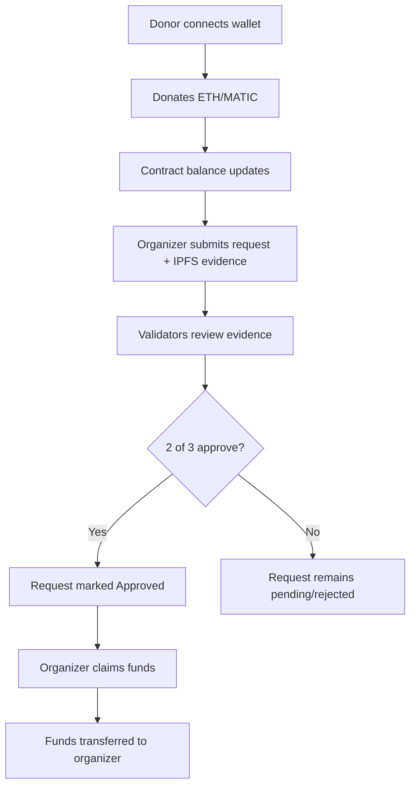

# ReliefChain: Blockchain Transparency for Disaster Aid in Vietnam

**INTE2641 - Blockchain Technology Fundamentals - Assignment 3**
**HN_Group 4: Luong Thi Tra My, Nguyen Hoang Gia Khanh, Nguyen Ngoc Dung**

---

## 📖 Overview

ReliefChain is a decentralized donation tracking platform built on the Polygon Amoy testnet (and locally on Hardhat). It records all donations and fund releases on-chain, creating a permanent public record that no single party can alter or delete. The platform uses a multi‑signature approval mechanism to ensure that funds are only released when trusted community validators confirm the legitimacy of a reimbursement request.

**Key Principle:** *Blockchain provides tamper‑proof records and decentralized validation, which centralized systems cannot guarantee.*

---

## ❗ Problem Statement

Vietnam is one of the world's most climate‑vulnerable nations. Recent disasters such as the **2020 Central Vietnam floods** and **Super Typhoon Yagi (2024)** caused massive damage and triggered large‑scale public fundraising. However, scandals over delayed distribution and opaque spending have eroded public trust.

Current charity systems suffer from:

- **Lack of transparency** in fund flows.
- **No verifiable proof** that aid reached intended recipients.
- **No immutable audit trail** to hold organizers accountable.

---

## 💡 Proposed Solution: ReliefChain

ReliefChain is a smart contract‑based donation platform that enforces **conditional release of funds**. The workflow replaces manual trust with on‑chain verification:

1. **Donors** send funds to a single campaign contract.
2. **Field organizers** submit reimbursement requests with IPFS‑hosted evidence (receipts, photos).
3. **Validators** review the evidence and vote to approve (2‑of‑3 majority required).
4. **Funds are released automatically** to the organizer's wallet upon approval.
5. **Every transaction is permanently recorded** for public audit.

---

## 🌏 Real‑Life Scenario: Typhoon Yagi Relief

> **Typhoon Yagi** made landfall in Vietnam in September 2024, causing over 300 deaths and $3.47 billion in damages. Massive private fundraising followed, but questions soon arose about where the money went.

### 🧭 ReliefChain Workflow (Yagi Example)

| Step                            | Real‑World Action                                                                                                          | Blockchain Execution                                                                                                                                                                                             |
| :------------------------------ | :-------------------------------------------------------------------------------------------------------------------------- | :--------------------------------------------------------------------------------------------------------------------------------------------------------------------------------------------------------------- |
| **1. Fundraising**        | Thousands of donors across Vietnam and abroad contribute via bank transfer or MoMo.                                         | Each donation is sent to the `ReliefChain` smart contract. The total amount raised is visible on‑chain in real time.                                                                                          |
| **2. Aid Procurement**    | A Red Cross volunteer in Quang Ninh purchases 500 emergency kits from a local supplier for**₫50 million**.           | The volunteer uploads the receipt and a photo of the distribution to**IPFS** and submits a **reimbursement request** to the contract with the IPFS link (`QmXyZ...`).                              |
| **3. Validation**         | A committee of three trusted local entities (e.g., Commune People's Committee, Fatherland Front, NGO) reviews the evidence. | Each validator uses their own MetaMask wallet to call `voteOnRequest`. The smart contract tracks approvals.                                                                                                    |
| **4. Approval & Payment** | The committee agrees the expense is legitimate.                                                                             | When**2 of the 3** validators approve, the request is marked **Approved**. The volunteer then calls `claimApprovedFunds` to instantly receive the **₫50 million** in MATIC to their wallet. |
| **5. Audit**              | The government and the public ask for accountability.                                                                       | Every donation, every request, every vote, and every payout is**immutable and publicly visible** on the Polygon blockchain (or local Hardhat explorer).                                                    |

---

## 👥 User Roles & Flows

| Role                | Description                                                      | Actions in dApp                                                                                                                         |
| :------------------ | :--------------------------------------------------------------- | :-------------------------------------------------------------------------------------------------------------------------------------- |
| **Donor**     | Individuals contributing to the campaign.                        | Connect wallet → Enter amount → Click**Donate** → Confirm transaction.                                                         |
| **Organizer** | Field workers (e.g., Red Cross) purchasing and distributing aid. | Connect wallet → Enter amount & IPFS CID → Click**Submit Request** → Wait for approval → Click **Claim** once approved. |
| **Validator** | Trusted local authorities (3 predefined addresses).              | Connect wallet → Select request ID → Click**Approve** (or Reject) → Confirm transaction.                                       |
| **Observer**  | Public / Auditor.                                                | Anyone can view the dashboard, read campaign stats, and inspect the on‑chain data via PolygonScan.                                     |

### 🔁 Complete User Flow (UI Walkthrough)

_Detailed UI steps for the demo:_

1.  Donate – Enter `0.5`, set gas limit to `500000`, confirm.
    
2.  Request – Enter `0.2`, CID `QmTest123`, confirm.
    
3.  Vote (Validator 1) – Select ID `0`, click Approve, confirm.
    
4.  Vote (Validator 2) – Switch MetaMask account, refresh page, select ID `0`, click Approve.
    
5.  Claim – Switch back to Organizer account, click Claim.
    

* * *

## ⚙️ Technical Architecture

| Component | Technology | Purpose |
| --- | --- | --- |
| Blockchain | Polygon Amoy Testnet (and Hardhat Local) | Low‑cost, EVM‑compatible test environment. |
| Smart Contracts | Solidity 0.8.20 + OpenZeppelin (AccessControl, ReentrancyGuard) | Core campaign logic, role management, fund escrow. |
| Development | Hardhat 2.x | Compilation, testing, deployment. |
| Frontend | React 18 + Vite | User interface. |
| Wallet Connection | RainbowKit + wagmi + ethers.js v5 | Seamless MetaMask integration. |
| Decentralised Storage | IPFS (via Pinata) | Immutable storage of evidence files (receipts, photos). |

### 🔐 Security Features

-   ReentrancyGuard on all fund‑transfer functions.
    
-   Role‑Based Access Control (RBAC) for Organizers and Validators.
    
-   Checks‑Effects‑Interactions pattern followed.
    
-   No upgradeable proxies (reduced attack surface).
    

* * *

## 🚀 Local Development Setup (How We Built It)

Follow these steps to run the project on your Windows machine.

### 📋 Prerequisites

-   Node.js v18+ and npm
    
-   MetaMask browser extension
    
-   Git (optional)
    

### 1️⃣ Clone & Install Dependencies

powershell

git clone <your-repo-url> relief-chain
cd relief-chain

\# Backend (Hardhat)
cd hardhat
npm install

\# Frontend (React)
cd ../frontend
npm install

### 2️⃣ Configure Environment Variables

`hardhat/.env`

PRIVATE\_KEY=your\_metamask\_private\_key
AMOY\_RPC\_URL=https://polygon-amoy.g.alchemy.com/v2/YOUR\_KEY
PINATA\_API\_KEY=your\_pinata\_jwt
PINATA\_SECRET\_KEY=

`frontend/.env`

VITE\_CONTRACT\_ADDRESS=0xCf7Ed3AccA5a467e9e704C703E8D87F634fB0Fc9

### 3️⃣ Start Local Hardhat Node

cd hardhat
npx hardhat node

Keep this terminal open.

### 4️⃣ Deploy Contract to Localhost

In a new terminal:

cd hardhat
npx hardhat run scripts/deploy.js \--network localhost

Copy the deployed contract address and update `frontend/.env` (or hardcode it in `App.jsx`).

### 5️⃣ Launch Frontend

cd frontend
npm run dev

Visit `http://localhost:5173`. Connect MetaMask to Hardhat Local (Chain ID `31337`, RPC `http://127.0.0.1:8545`) and import one of the test accounts provided by the Hardhat node.

### 6️⃣ Test the Workflow

Follow the Complete User Flow section above to donate, request, vote, and claim.

* * *

## 📁 Project Structure

text

relief-chain/
├── hardhat/
│   ├── contracts/
│   │   └── ReliefChain.sol          # Main smart contract
│   ├── scripts/
│   │   └── deploy.js                # Deployment script
│   ├── .env                         # Secrets (private key, RPC)
│   ├── hardhat.config.js            # Network & compiler config
│   └── artifacts/                   # Compiled contract ABI
├── frontend/
│   ├── src/
│   │   ├── App.jsx                  # Main React component
│   │   ├── ReliefChainABI.json      # Contract ABI (generated)
│   │   └── main.jsx                 # Entry point
│   ├── .env                         # Vite contract address
│   └── index.html
└── README.md                        # This file

* * *

## 🔮 Production Roadmap (Beyond the Demo)

-   Validator Governance: Replace hardcoded validators with a Soulbound Token (SBT) system that verifies official registration with Vietnamese relief authorities.
    
-   Multi‑Campaign Factory: Deploy a factory contract that creates isolated campaign instances for each disaster event.
    
-   IPFS Evidence Verification: Add a Pinata upload widget in the frontend for seamless evidence submission.
    
-   Amoy Testnet Deployment: Once sufficient test MATIC is obtained, deploy to Polygon Amoy for a live public demonstration.
    

* * *

## 📚 References

1.  Luu, C., von Meding, J., & Mojahedi, M. (2019). Analyzing Vietnam's national disaster loss database. _Int. J. Disaster Risk Reduct._
    
2.  World Bank Group. (2022). _Vietnam Country Climate and Development Report_.
    
3.  IFRC. (2022). _Vietnam: Floods – Final Report_.
    
4.  Center for Disaster Philanthropy. (2024). _2024 Super Typhoon Yagi_.
    
5.  Nguyen, L. & Thu, N. (2021). Vietnamese celebs face scandal over philanthropy. _VnExpress_.
    
6.  Farooq, M. S., et al. (2020). A framework to make charity collection transparent using blockchain. _Comput. Electr. Eng._
    
7.  OpenZeppelin Contracts Documentation.
    
8.  Polygon Amoy Testnet Documentation.
    

* * *

© 2026 HN\_Group 4 – RMIT University Vietnam  
_This project is developed for educational purposes on test networks only._
